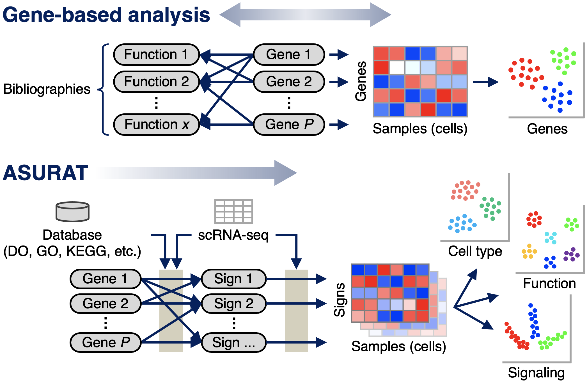

# ASURAT
ASURAT (functional annotation-driven unsupervised clustering of single-cell transcriptomes) is a computational tool, implemented in R programming language, for single-cell transcriptomics.
Using ASURAT, one can simultaneously perform unsupervised clustering and biological interpretation in terms of cell type, disease, biological process, and signaling pathway activity.

<br>




## Vignettes
### Basic usage
Below is a vignette reviewed by Bioconductor reviewers:

https://keita-iida.github.io/ASURAT/


### Case studies
Below are documents for analyzing several single-cell and spatial transcriptome datasets:

* [PBMC 4k from healthy donors (10x Genomics)](https://keita-iida.github.io/ASURATBI/02-pbmc4k.html)
* [PBMC 6k from healthy donors (10x Genomics)](https://keita-iida.github.io/ASURATBI/03-pbmc6k.html)
* [PBMCs from control and sepsis donors (Reyes et al., 2020)](https://keita-iida.github.io/ASURATBI/04-pbmc130k.html)
* [Small cell lung cancer (Stewart et al., 2020)](https://keita-iida.github.io/ASURATBI/01-sclc.html)
* [Pancreatid ductal adenocarcinoma (Moncada et al., 2020)](https://keita-iida.github.io/ASURATBI/05-pdac.html)


## Change Log
### v1.0.0
ASURAT was released on Bioconductor 3.1.5 (DOI: 10.18129/B9.bioc.ASURAT).


## Installation
One can install ASURAT by the following code:

```r
if (!require("BiocManager", quietly = TRUE))
    install.packages("BiocManager")

# The following initializes usage of Bioc devel
BiocManager::install(version='devel')

BiocManager::install("ASURAT")
```

## Bioconductor
One can find ASURAT in the following Bioconductor page:

* https://bioconductor.org/packages/devel/bioc/html/ASURAT.html

## Preprint
The latest version is available from the following bioRxiv page:

* https://www.biorxiv.org/content/10.1101/2021.06.09.447731v3

## License
[GPL-3](https://github.com/keita-iida/ASURAT/blob/main/LICENSE)

